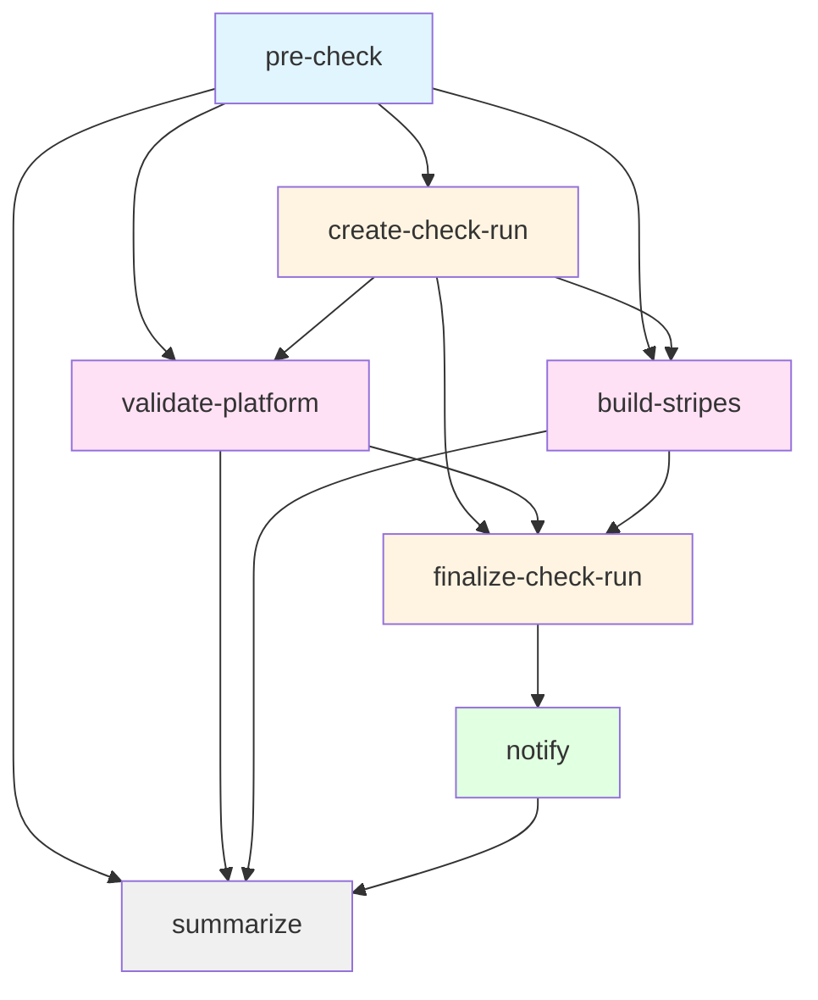

# Release PR Check Workflow

## Purpose

Validates platform release pull requests by verifying platform descriptors, dependencies, and Stripes UI compilation. Creates a GitHub check run with detailed results and sends Slack notifications.

## Triggers

- **workflow_dispatch**: Manual execution (current configuration)
- **pull_request**: Automated on PR events _(currently disabled, planned for future)_

## Workflow Inputs

| Input | Type | Default | Required | Description |
|-------|------|---------|----------|-------------|
| `repo_owner` | string | _context-derived_ | No | Repository owner |
| `repo_name` | string | _context-derived_ | No | Repository name |
| `pr_number` | string | _context-derived_ | No | Pull request number |
| `head_sha` | string | _context-derived_ | No | Head commit SHA |
| `node-version` | string | `20.x` | No | Node.js version for Stripes build |
| `folio-npm-registry` | string | `https://repository.folio.org/repository/npm-folio/` | No | FOLIO NPM registry URL |
| `yarn-lock-retention-days` | number | `1` | No | Artifact retention period |
| `allow-lint-errors` | boolean | `true` | No | Continue on lint errors _(currently disabled)_ |

## Job Flow



## Jobs

### pre-check
**Responsibility**: Validate PR existence, commit membership, and release configuration.

**Outputs**:
- `validation_status`: Configuration validation result (`success`, `skipped`)
- `validation_message`: Human-readable validation message
- `head_branch`: PR head branch name
- `base_branch`: PR base branch name

**Skip Conditions**:
- Configuration file (`.github/update-config.yml`) not found
- Release scanning disabled in configuration
- Target branch not in `release_branches` list
- Required PR labels missing

---

### create-check-run
**Responsibility**: Initialize GitHub check run and upload platform descriptor artifact.

**Outputs**:
- `check_run_id`: GitHub check run identifier

**Actions**:
- Creates check run named `eureka-ci/release-platform-validation`
- Uploads `platform-descriptor.json` as artifact (1-day retention)

---

### validate-platform
**Responsibility**: Validate platform descriptors and dependencies using composite action.

**Outputs**:
- `validation_passed`: Boolean validation result
- `failure_reason`: Error message on failure

**Composite Action**: `folio-org/platform-lsp/.github/actions/validate-platform@RANCHER-2324`

---

### build-stripes
**Responsibility**: Compile Stripes UI with FOLIO dependencies.

**Steps**:
1. Install Node.js (version from input)
2. Configure FOLIO NPM registry
3. Install dependencies via Yarn
4. List installed FOLIO packages
5. Upload `yarn.lock` artifact

**Note**: Linting is currently disabled pending platform stability.

---

### finalize-check-run
**Responsibility**: Update GitHub check run with final status and results.

**Conclusion Logic**:
- `failure`: Validation or build failed
- `success`: Both validation and build passed
- `neutral`: Build cancelled or incomplete

**Output Sections**:
- Configuration check status
- Platform validation results
- Stripes compilation status
- Workflow run details

---

### notify
**Responsibility**: Send Slack notifications to configured channels.

**Channels**:
- **Team Channel**: Repository variable `SLACK_NOTIF_CHANNEL` _(optional)_
- **General Channel**: Repository variable `GENERAL_SLACK_NOTIF_CHANNEL` _(optional)_

**Message Content**:
- Repository and PR information
- Release and update branches
- Validation and build status
- Failure reason (if applicable)

**Required Secret**: `EUREKA_CI_SLACK_BOT_TOKEN`

---

### summarize
**Responsibility**: Generate workflow summary in GitHub Actions UI.

**Runs**: Always (regardless of previous job failures)

**Summary Sections**:
- Pre-check status
- Platform validation status
- Stripes build status
- Notification delivery status

## Configuration Requirements

### Repository File
**`.github/update-config.yml`** must exist with:
```yaml
enabled: true
release_branches:
  - master
  - R1-2024
pr_labels:
  - release-ready
```

### Repository Variables
| Variable | Purpose | Required |
|----------|---------|----------|
| `FAR_URL` | FOLIO Artifact Repository URL | Yes |
| `SLACK_NOTIF_CHANNEL` | Team Slack channel ID | No |
| `GENERAL_SLACK_NOTIF_CHANNEL` | General Slack channel ID | No |

### Repository Secrets
| Secret | Purpose | Required |
|--------|---------|----------|
| `EUREKA_CI_SLACK_BOT_TOKEN` | Slack bot OAuth token | Only if notifications enabled |

## Permissions

```yaml
permissions:
  contents: read
  checks: write
  statuses: write
```

## Usage Example

### Manual Trigger (Current)
```bash
gh workflow run release-pr-check.yml \
  --repo folio-org/platform-lsp \
  -f pr_number=123 \
  -f head_sha=abc123def456 \
  -f node-version=20.x
```

### Future Automated Trigger
Once `pull_request` trigger is enabled, the workflow will run automatically when:
- PR is opened/synchronized/reopened
- Required labels are added

## Artifacts

| Name | Content | Retention |
|------|---------|-----------|
| `platform-descriptor` | `platform-descriptor.json` | 1 day |
| `yarn.lock` | Dependency lock file | Configurable (default: 1 day) |

## Exit Codes

- **Success**: All validations and builds passed
- **Failure**: Validation failed or build failed
- **Neutral**: Build cancelled or workflow incomplete

## Related Documentation

- [Composite Action: validate-platform](../actions/validate-platform/README.md) _(if exists)_
- [Update Configuration Schema](../update-config.yml)
- [FOLIO CI/CD Standards](https://github.com/folio-org/kitfox-github)

