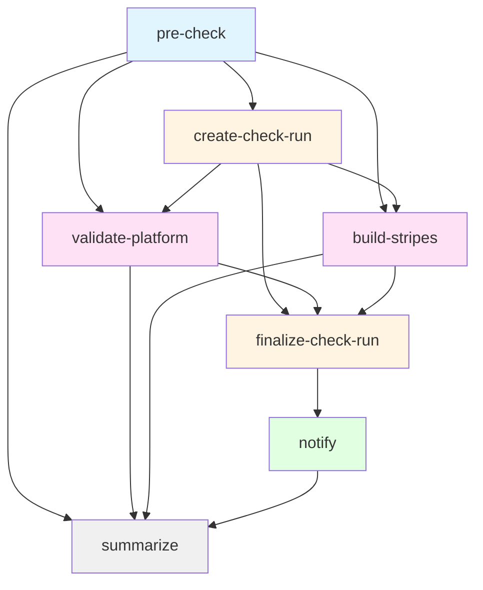

# Release PR Check Workflow

## Purpose

Validates platform release pull requests by verifying platform descriptors, dependencies, and Stripes UI compilation. Publishes the `eureka-ci/release-platform-validation` check run with detailed results and sends Slack notifications.

## Triggers

- **workflow_dispatch**: the only declared trigger.
- Automated in practice via the Eureka CI GitHub App webhook listener, which dispatches this workflow for
  `pull_request` (opened, reopened, synchronize, ready_for_review), `check_suite` and `check_run` events on
  `folio-org/platform-lsp`. The mappings live in
  `kitfox-github/gh-app-webhook-listener/terraform/environments/github_events_config.json`.
- The in-file `pull_request` / `pull_request_target` triggers remain commented out; the webhook path is used
  instead, so the workflow runs automatically despite declaring only `workflow_dispatch`.

## Workflow Inputs

| Input | Type | Default | Required | Description |
|-------|------|---------|----------|-------------|
| `repo_owner` | string | `folio-org` | Yes | Repository owner |
| `repo_name` | string | `platform-lsp` | Yes | Repository name |
| `pr_number` | string | - | Yes | Pull request number |
| `head_sha` | string | - | Yes | Head commit SHA |
| `node-version` | string | `22` | Yes | Node.js version for Stripes build |
| `folio-npm-registry` | string | `https://repository.folio.org/repository/npm-folio/` | Yes | FOLIO NPM registry URL |
| `yarn-lock-retention-days` | number | `1` | Yes | Artifact retention period |

`pr_number` being required is why this workflow cannot serve a `merge_group` event: that mapping carries no
pull request number.

## Job Flow


```mermaid
flowchart TD
    A[pre-check] --> B[create-check-run]
    A --> C[validate-platform]
    A --> D[build-stripes]
    
    B --> C
    B --> D
    B --> E[finalize-check-run]
    
    C --> E
    D --> E
    
    E --> F[notify]
    
    A --> G[summarize]
    C --> G
    D --> G
    F --> G
    
    style A fill:#e1f5ff
    style B fill:#fff4e1
    style C fill:#ffe1f5
    style D fill:#ffe1f5
    style E fill:#fff4e1
    style F fill:#e1ffe1
    style G fill:#f0f0f0
```

## Jobs

### pre-check
**Responsibility**: Validate PR existence, commit membership, and release configuration.

**Outputs**:
- `validation_status`: Configuration validation result (`success`, `skipped`)
- `validation_message`: Human-readable validation message
- `head_branch`: PR head branch name
- `base_branch`: PR base branch name

**Skip Conditions**:
- Configuration file (`.github/update-config.yml`) not found
- Release scanning disabled in configuration
- Target branch not listed under `branches`
- Required PR labels missing

---

### create-check-run
**Responsibility**: Initialize GitHub check run and upload platform descriptor artifact.

**Outputs**:
- `check_run_id`: GitHub check run identifier

**Actions**:
- Mints an Eureka CI App installation token (`actions/create-github-app-token@v3`)
- Creates check run named `eureka-ci/release-platform-validation`, published as the Eureka CI App
- Uploads `platform-descriptor.json` as artifact (1-day retention)

---

### validate-platform
**Responsibility**: Validate platform descriptors and dependencies using composite action.

**Outputs**:
- `validation_passed`: Boolean validation result
- `failure_reason`: Error message on failure

**Composite Action**: `folio-org/platform-lsp/.github/actions/validate-platform@master`

---

### build-stripes
**Responsibility**: Compile Stripes UI with FOLIO dependencies.

**Steps**:
1. Install Node.js (version from input)
2. Configure FOLIO NPM registry
3. Install dependencies via Yarn
4. List installed FOLIO packages
5. Upload `yarn.lock` artifact

**Note**: Linting is currently disabled pending platform stability.

---

### finalize-check-run
**Responsibility**: Update GitHub check run with final status and results.

Mints its own App token first, like every job that touches the check run.

**Conclusion Logic**:
- `failure`: Validation or build failed
- `success`: Both validation and build passed
- `neutral`: Build cancelled or incomplete

**Output Sections**:
- Configuration check status
- Platform validation results
- Stripes compilation status
- Workflow run details

---

### notify
**Responsibility**: Send Slack notifications to configured channels.

**Channels**:
- **Team Channel**: Repository variable `SLACK_NOTIF_CHANNEL` _(optional)_
- **General Channel**: Repository variable `GENERAL_SLACK_NOTIF_CHANNEL` _(optional)_

**Message Content**:
- Repository and PR information
- Release and update branches
- Validation and build status
- Failure reason (if applicable)

**Required Secret**: `EUREKA_CI_SLACK_BOT_TOKEN`

---

### summarize
**Responsibility**: Generate workflow summary in GitHub Actions UI.

**Runs**: Always (regardless of previous job failures)

**Summary Sections**:
- Pre-check status
- Platform validation status
- Stripes build status
- Notification delivery status

## Configuration Requirements

### Repository File
**`.github/update-config.yml`** must exist on `master`, in the schema `get-update-config` parses:

```yaml
update_config:
  enabled: true
  update_branch_format: version-update/{0}
  labels:
    - version-update
  ruleset:
    enabled: true
    required_checks:
      - context: "eureka-ci/release-platform-validation"

branches:
  - snapshot:
      enabled: true
      need_pr: false
  - R1-2026:
      enabled: true
      need_pr: true
      ruleset:
        enabled: true
```

`branches` is a list of single-key maps, one per branch. The workflow skips a branch that is absent from it,
and skips any branch whose `need_pr` is not `true`.

The `ruleset` block is what makes this check *required*: `branch-ruleset-automation.yml` turns it into a
GitHub branch ruleset naming `eureka-ci/release-platform-validation` as a required status check. See
[Update Configuration Schema](https://github.com/folio-org/kitfox-github/blob/master/.github/docs/update-config.md)
for the full schema.

### Repository Variables
| Variable | Purpose | Required |
|----------|---------|----------|
| `EUREKA_CI_APP_ID` | Eureka CI GitHub App ID, used to mint the check-run token | Yes |
| `FAR_URL` | FOLIO Artifact Repository URL | Yes |
| `SLACK_NOTIF_CHANNEL` | Team Slack channel ID | No |
| `GENERAL_SLACK_NOTIF_CHANNEL` | General Slack channel ID | No |

### Repository Secrets
| Secret | Purpose | Required |
|--------|---------|----------|
| `EUREKA_CI_APP_KEY` | Eureka CI GitHub App private key | Yes |
| `EUREKA_CI_SLACK_BOT_TOKEN` | Slack bot OAuth token | Only if notifications enabled |

## Check Run Identity

The check run is created and updated with an **Eureka CI App installation token**, not `GITHUB_TOKEN`. This is
required, not stylistic: the branch ruleset pins each required check to an `integration_id`, resolved from
`EUREKA_CI_APP_ID`. A check run published with `GITHUB_TOKEN` belongs to the GitHub Actions app instead, so it
would never satisfy the rule and the PR would sit on "Expected — waiting for status to be reported".

A check run can only be updated by the app that created it, so all four jobs that touch it —
`create-check-run`, `validate-platform`, `build-stripes`, `finalize-check-run` — mint their own App token.
Everything else (checkout, artifacts, `get-pr-info`, `is-commit-in-pr`, reading repository variables) still
uses `GITHUB_TOKEN`.

## Permissions

```yaml
permissions:
  contents: read
  checks: write
  statuses: write
```

These apply to `GITHUB_TOKEN`. Note that `checks: write` no longer covers the check run itself — that is
written under the App token described above.

## Usage Example

### Manual Trigger
```bash
gh workflow run release-pr-check.yml \
  --repo folio-org/platform-lsp \
  -f pr_number=123 \
  -f head_sha=abc123def456
```

### Automated Trigger
The webhook listener dispatches the same workflow with the same inputs when a PR is opened, reopened,
synchronized or marked ready for review, and on `check_suite` / `check_run` events. Re-enabling the in-file
`pull_request` trigger would duplicate that path, not replace it.

## Artifacts

| Name | Content | Retention |
|------|---------|-----------|
| `platform-descriptor` | `platform-descriptor.json` | 1 day |
| `yarn.lock` | Dependency lock file | Configurable (default: 1 day) |

## Exit Codes

- **Success**: All validations and builds passed
- **Failure**: Validation failed or build failed
- **Neutral**: Build cancelled or workflow incomplete

## Related Documentation

- [Composite Action: validate-platform](../actions/validate-platform/README.md) _(if exists)_
- [Repository configuration](../update-config.yml) — this repository's `update-config.yml`
- [Update Configuration Schema](https://github.com/folio-org/kitfox-github/blob/master/.github/docs/update-config.md) — the schema that file follows
- [Branch Ruleset Automation](https://github.com/folio-org/kitfox-github/blob/master/.github/docs/branch-ruleset-automation.md) — how the required check becomes required
- [FOLIO CI/CD Standards](https://github.com/folio-org/kitfox-github)

