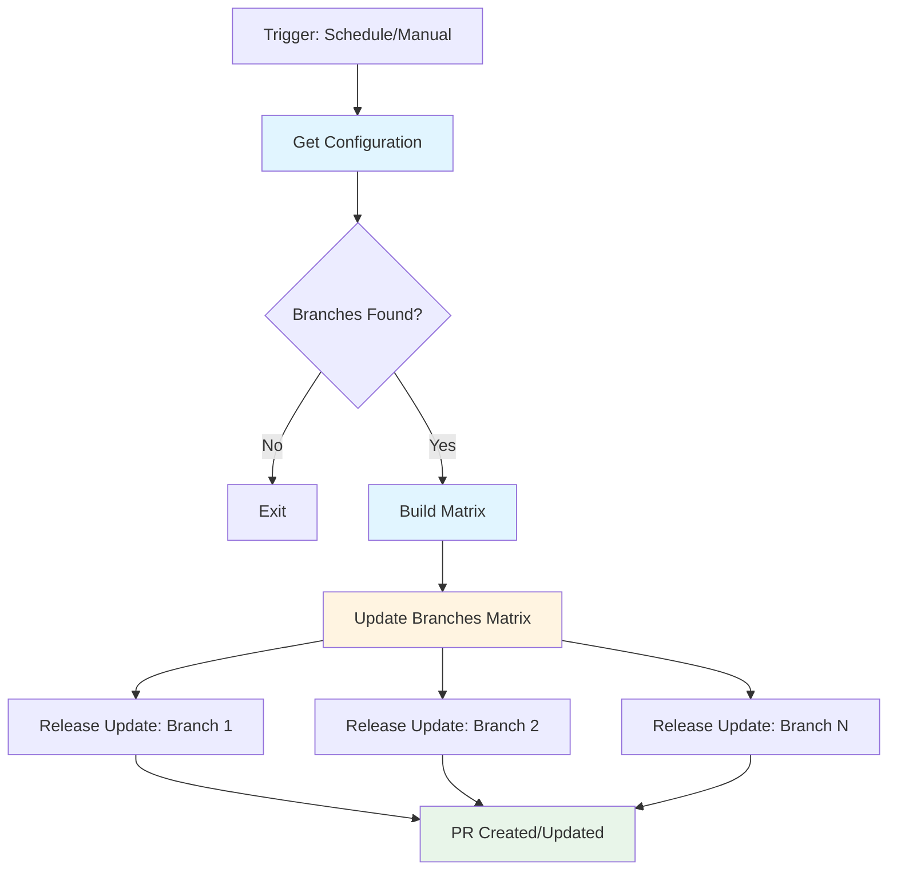

# Release Scan Workflow

**Automated discovery and update orchestration for platform release branches**

The Release Scan workflow orchestrates the automated discovery and update of platform release branches. It identifies configured release branches, maps them to their update branches, and triggers update workflows for each branch in parallel.

## 🎯 Purpose

Automates the platform release update process by:

- **Discovering release branches** from repository configuration
- **Orchestrating updates** across multiple release branches concurrently
- **Creating pull requests** with updated module versions
- **Supporting dry runs** for safe validation before production execution

## 🏗️ Workflow Architecture



## ⚙️ Configuration

### Repository Configuration

The workflow reads configuration from `.github/update-config.yml`:

```yaml
release:
  branches:
    - name: R1-2024
      update_branch: R1-2024-updates
    - name: R2-2024
      update_branch: R2-2024-updates
  pr_reviewers: team-lead,senior-dev
  pr_labels: automated-update,release
```

### Workflow Inputs

| Input | Type | Default | Description |
|-------|------|---------|-------------|
| `dry_run` | boolean | `false` | Run without creating PRs (manual trigger only) |

## 🚀 Usage

### Manual Execution

Trigger via GitHub Actions UI:
```
Actions → Release Scan → Run workflow
  ├─ Branch: master (or target branch)
  └─ Dry run: ☑ (optional)
```

### Scheduled Execution

Enable automatic scanning by uncommenting the schedule trigger:

```yaml
on:
  schedule:
    - cron: '0 * * * *'  # Hourly
```

## 🔄 Job Flow

### 1. Get Configuration
- Retrieves release branch configuration from repository
- Extracts PR reviewer and label settings
- Builds branch-to-update-branch mapping

### 2. Update Branches (Matrix)
- Executes [`release-update.yml`](../workflows/release-update.yml) for each branch
- Runs up to 3 branches concurrently (`max-parallel: 3`)
- Continues on failure (`fail-fast: false`)
- Passes configuration to child workflows

## 🔐 Permissions

- `contents: write` – Create commits and branches
- `pull-requests: write` – Create and update PRs

## 🛡️ Concurrency Control

Prevents overlapping executions:
- Scheduled runs use single `scheduled` group
- Manual/push runs grouped by branch reference
- No cancellation of in-progress runs

## 📋 Related Workflows

- [release-update.yml](../workflows/release-update.yml) – Individual branch update workflow
- [update-config.yml](../update-config.yml) – Configuration schema

## 🔍 Monitoring

Check workflow execution:
```bash
gh run list --workflow=release-scan.yml
gh run view <run-id> --log
```

View matrix job results:
```bash
gh run view <run-id> --json jobs --jq '.jobs[] | select(.name | startswith("Update")) | {name, conclusion}'
```

