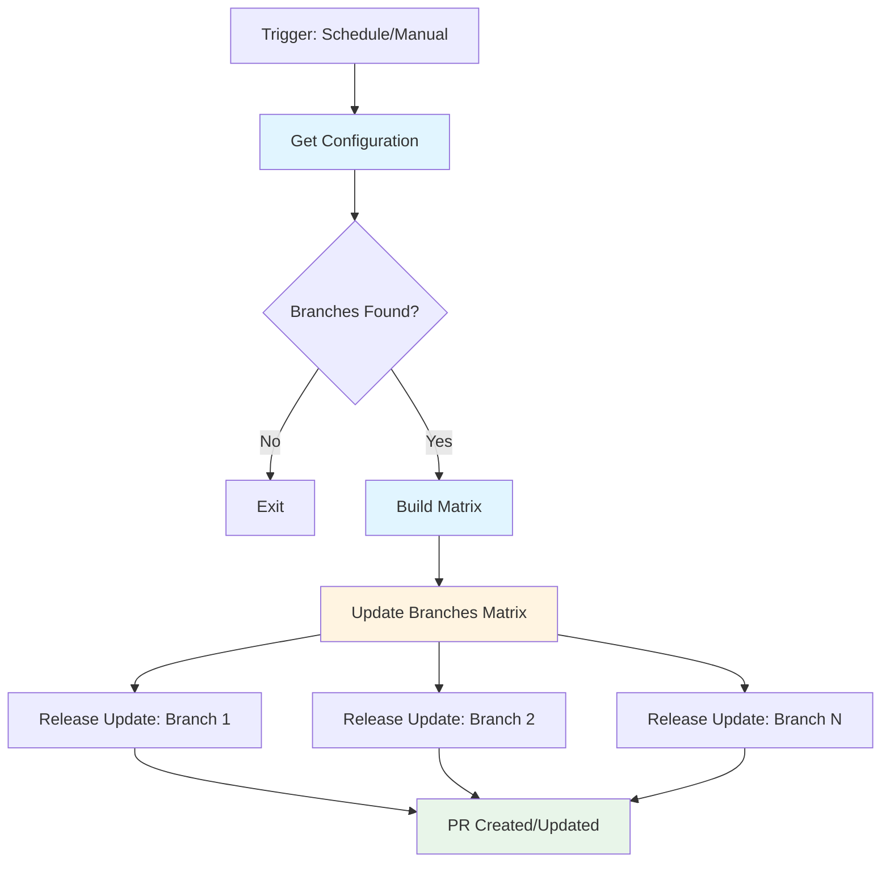

# Release Scan Workflow

**Automated discovery and update orchestration for platform release branches**

The Release Scan workflow orchestrates the automated discovery and update of platform release branches. It identifies configured release branches, maps them to their update branches, and triggers update workflows for each branch in parallel.

## 🎯 Purpose

Automates the platform release update process by:

- **Discovering release branches** from repository configuration
- **Orchestrating updates** across multiple release branches concurrently
- **Creating pull requests** with updated module versions
- **Supporting dry runs** for safe validation before production execution

## 🏗️ Workflow Architecture


```mermaid
flowchart TD
    A[Trigger: Schedule/Manual] --> B[Get Configuration]
    B --> C{Branches Found?}
    C -->|No| D[Exit]
    C -->|Yes| E[Build Matrix]
    E --> F[Update Branches Matrix]
    F --> G1[Release Update: Branch 1]
    F --> G2[Release Update: Branch 2]
    F --> G3[Release Update: Branch N]
    G1 --> H[PR Created/Updated]
    G2 --> H
    G3 --> H
    
    style B fill:#e1f5ff
    style E fill:#e1f5ff
    style F fill:#fff4e1
    style H fill:#e8f5e9
```

## ⚙️ Configuration

### Repository Configuration

The workflow reads configuration from `.github/update-config.yml` on `master`, through the shared
`get-update-config` action:

```yaml
update_config:
  enabled: true                                 # master switch for the whole repository
  update_branch_format: version-update/{0}      # {0} = branch name
  labels:
    - version-update
  pr_reviewers:
    - folio-org/kitfox
    - folio-org/fse-platform
  ruleset:                                      # branch rulesets, applied by kitfox-github
    enabled: true
    required_checks:
      - context: "eureka-ci/release-platform-validation"

branches:
  - snapshot:
      enabled: true
      need_pr: false                            # direct commit
      pre_release: "only"
      ruleset:
        enabled: false                          # no ruleset while the branch takes direct commits
  - R1-2026:
      enabled: true
      need_pr: true                             # update PR
      pre_release: "false"
      ruleset:
        enabled: true
```

`branches` is a list of single-key maps; a branch whose `enabled` is not `true` is skipped entirely, before
its ruleset is even resolved, so an existing ruleset is left untouched rather than disabled.

The `ruleset` block is not consumed by this workflow. It is read by `branch-ruleset-automation.yml` in
kitfox-github, dispatched on a push that touches this file. See
[Update Configuration Schema](https://github.com/folio-org/kitfox-github/blob/master/.github/docs/update-config.md)
for the full schema, including the deep-merge rules between the global and per-branch blocks.

### Workflow Inputs

| Input | Type | Default | Description |
|-------|------|---------|-------------|
| `dry_run` | boolean | `false` | Run without creating PRs (manual trigger only) |

## 🚀 Usage

### Manual Execution

Trigger via GitHub Actions UI:
```
Actions → Release Scan → Run workflow
  ├─ Branch: master (or target branch)
  └─ Dry run: ☑ (optional)
```

### Scheduled Execution

Enable automatic scanning by uncommenting the schedule trigger:

```yaml
on:
  schedule:
    - cron: '0 * * * *'  # Hourly
```

## 🔄 Job Flow

### 1. Get Configuration
- Retrieves release branch configuration from repository
- Extracts PR reviewer and label settings
- Builds branch-to-update-branch mapping

### 2. Update Branches (Matrix)
- Executes [`release-update.yml`](../workflows/release-update.yml) for each branch
- Runs up to 3 branches concurrently (`max-parallel: 3`)
- Continues on failure (`fail-fast: false`)
- Passes configuration to child workflows

## 🔐 Permissions

- `contents: write` – Create commits and branches
- `pull-requests: write` – Create and update PRs

## 🛡️ Concurrency Control

Prevents overlapping executions:
- Scheduled runs use single `scheduled` group
- Manual/push runs grouped by branch reference
- No cancellation of in-progress runs

## 📋 Related Workflows

- [release-update.yml](../workflows/release-update.yml) – Individual branch update workflow
- [update-config.yml](../update-config.yml) – this repository's configuration
- [Update Configuration Schema](https://github.com/folio-org/kitfox-github/blob/master/.github/docs/update-config.md) – the schema it follows

## 🔍 Monitoring

Check workflow execution:
```bash
gh run list --workflow=release-scan.yml
gh run view <run-id> --log
```

View matrix job results:
```bash
gh run view <run-id> --json jobs --jq '.jobs[] | select(.name | startswith("Update")) | {name, conclusion}'
```

