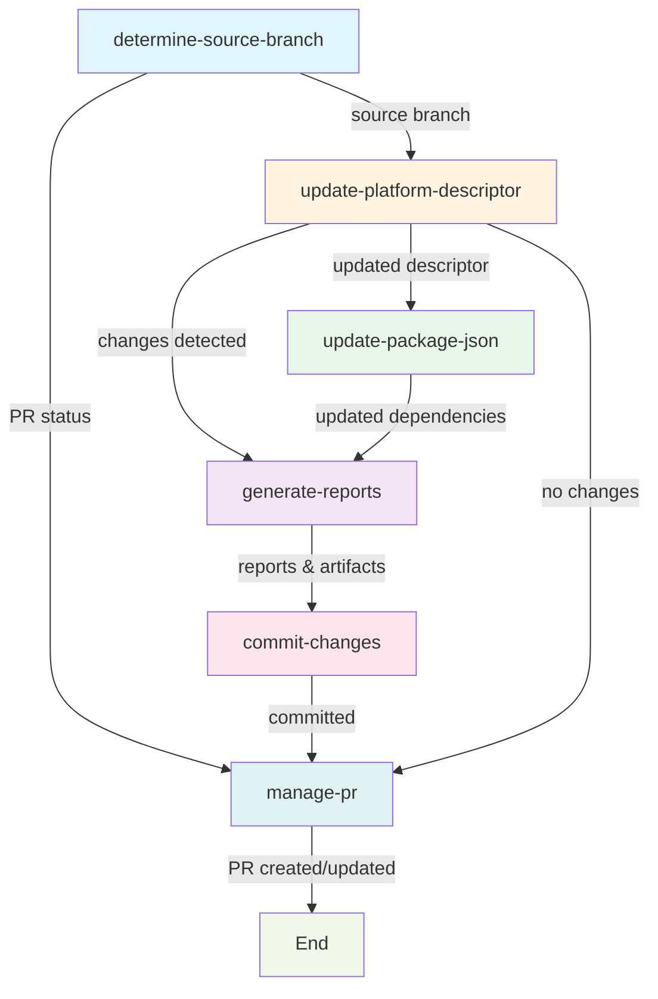

# Release Update Flow

**Core execution workflow for automated platform release updates**

The Release Update Flow (`release-update-flow.yml`) is the execution engine that performs the actual work of updating platform descriptors and UI dependencies for FOLIO release branches. It orchestrates multi-stage updates, generates diff reports, commits changes, and manages pull requests.

## 🎯 Purpose

Implements the complete release update lifecycle:

- **Discovers latest module versions** from FOLIO Artifact Repository
- **Updates platform-descriptor.json** with new component/application versions
- **Synchronizes package.json** with corresponding UI module versions
- **Generates comprehensive diff reports** for review
- **Commits changes** to update branch
- **Creates or updates pull requests** with detailed summaries

## 🏗️ Job Flow Architecture



## 📥 Inputs

| Input | Type | Required | Default | Description |
|-------|------|----------|---------|-------------|
| `repo` | string | ✓ | - | Repository name (`org/repo` format) |
| `release_branch` | string | ✓ | - | Release branch to update (e.g., `R1-2025`) |
| `update_branch` | string | ✓ | - | Update branch name for changes |
| `workflow_run_number` | string | ✓ | - | GitHub run number for display |
| `dry_run` | boolean | ✗ | `false` | Skip PR creation (validation mode) |
| `pr_reviewers` | string | ✗ | `''` | Reviewers (comma-separated, `org/team` for teams) |
| `pr_labels` | string | ✗ | `''` | PR labels (comma-separated) |

## 📤 Outputs

| Output | Type | Description |
|--------|------|-------------|
| `updated` | boolean | Whether platform descriptor was updated |
| `pr_created` | boolean | Whether PR was created or updated |
| `pr_url` | string | URL of created/updated PR |
| `pr_number` | string | PR number if created or updated |
| `workflow_status` | string | Overall status (`success`/`failure`) |
| `failure_reason` | string | Failure reason if applicable |
| `new_version` | string | New platform version after update |
| `updates_cnt` | string | Count of updated modules/components |

## 🔄 Job Descriptions

### 1. determine-source-branch
**Determines the correct source branch and checks PR status**

- Checks if update branch already exists
- Searches for existing PR between update and release branches
- Outputs source branch (update branch if exists, otherwise release branch)
- Used to ensure idempotent updates

**Outputs**: `source_branch`, `update_branch_exists`, `pr_exists`, `pr_number`, `pr_url`

### 2. update-platform-descriptor
**Updates platform-descriptor.json with latest component versions**

- Fetches base descriptor from release branch
- Queries FOLIO Artifact Repository for latest versions of:
  - Eureka components (backend modules)
  - Applications (app descriptors)
- Compares with current versions
- Calculates new platform version (patch increment)
- Generates updated descriptor artifact

**Outputs**: `updated`, `updated_components`, `updated_applications`, `new_version`, `failure_reason`

### 3. update-package-json
**Synchronizes package.json UI dependencies with application updates**

- Fetches UI module mappings from updated applications
- Queries FOLIO Artifact Repository for NPM package versions
- Updates `dependencies` section of package.json
- Tracks missing UI modules for reporting

**Outputs**: `has_updates`, `updated_count`, `not_found_ui_report`

**Condition**: Only runs if platform descriptor was updated

### 4. generate-reports
**Creates comprehensive diff reports for all changes**

- Generates Markdown diff for platform-descriptor.json changes
- Generates Markdown diff for package.json dependency changes
- Creates collapsible report sections
- Writes summary to GitHub Actions summary
- Uploads combined artifacts for commit

**Outputs**: `updates_markdown`, `ui_updates_markdown`, `missing_ui_markdown`, `updates_cnt`, `artifact_name`

**Condition**: Always runs unless cancelled (reports no-change scenarios too)

### 5. commit-changes
**Commits and pushes changes to update branch**

- Downloads combined artifact (descriptor + package.json)
- Creates commit with detailed message including update count
- Pushes to update branch (creates branch if needed)
- Uses GitHub App token for authentication

**Condition**: Only runs if updates detected

### 6. manage-pr
**Creates new or updates existing pull request**

- Builds PR body with collapsible diff reports
- Creates PR if none exists
- Updates existing PR title and body
- Applies labels and reviewers
- Handles reviewer failures gracefully

**Outputs**: `pr_created`, `pr_updated`, `pr_number`, `pr_url`, `successful_reviewers`, `failed_reviewers`

**Condition**: Runs if updates detected OR update branch exists without PR

## 🚀 Usage

### Called from Parent Workflow

```yaml
jobs:
  execute-update:
    uses: folio-org/platform-lsp/.github/workflows/release-update-flow.yml@master
    with:
      repo: folio-org/platform-lsp
      release_branch: R1-2025
      update_branch: R1-2025-updates
      workflow_run_number: ${{ github.run_number }}
      dry_run: false
      pr_reviewers: 'folio-org/kitfox'
      pr_labels: 'automated-update,release'
    secrets: inherit
```

### Direct Dispatch (Testing Only)

```yaml
# Triggered via workflow_dispatch
# Note: workflow_dispatch trigger should be removed before production merge
```

## 🔐 Permissions

- `contents: write` - Required for branch creation and commits
- `pull-requests: write` - Required for PR creation and updates

## ⚙️ Configuration

### Environment Variables

| Variable | Value | Purpose |
|----------|-------|---------|
| `STATE_FILE` | `platform-descriptor.json` | Platform descriptor filename |
| `FAR_URL` | `https://far.ci.folio.org` | FOLIO Artifact Repository URL |
| `ARTIFACT_NAME` | `platform-lsp-update-files` | Artifact name for file sharing |
| `GH_TOKEN` | `${{ github.token }}` | GitHub CLI authentication |

### Concurrency Control

```yaml
concurrency:
  group: release-update-${{ inputs.repo }}-${{ inputs.release_branch }}-${{ inputs.update_branch }}
  cancel-in-progress: true
```

Prevents simultaneous updates to the same release/update branch combination.

## 📝 Notes

### Version Increment Strategy
- **Patch version increment** applied when changes detected
- No increment if no changes found (idempotent)

### Branch Strategy
- **First run**: Checks out `release_branch`, creates `update_branch`
- **Subsequent runs**: Checks out existing `update_branch`, updates in place
- PR remains open for iterative updates until manually merged

### Artifact Flow
1. `platform-descriptor-files-*` - Descriptor and base file
2. `package-json-files-*` - Package.json and base file
3. `platform-lsp-update-files` - Combined final artifact for commit

### Error Handling
- Jobs continue on failure where possible to generate reports
- `workflow_status` output reflects overall success/failure
- `failure_reason` captures specific error details

## 🔗 Related Workflows

- `release-update.yml` - Wrapper providing stable interface
- `commit-and-push-changes.yml` - Git commit/push logic
- `create-pr.yml` / `update-pr.yml` - PR management actions

## 🛠️ Composite Actions Used

- `check-branch-and-pr-status` - Branch and PR detection
- `fetch-base-file` - Base file retrieval for diffs
- `update-eureka-components` - Backend component updates
- `update-applications` - Application descriptor updates
- `fetch-updated-ui-modules` - UI module version mapping
- `update-package-json` - Dependency synchronization
- `calculate-version-increment` - Version calculation
- `generate-platform-diff-report` - Descriptor diff generation
- `generate-package-diff-report` - Package.json diff generation
- `generate-markdown-reports` - Report formatting
- `build-pr-body` - PR description builder

