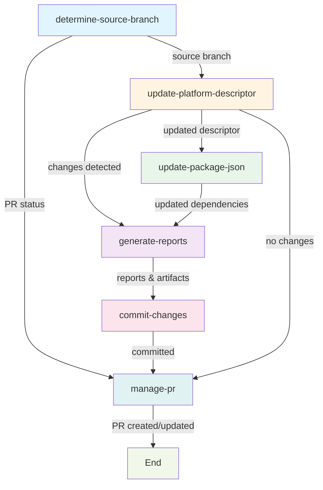

# Release Update Flow

**Core execution workflow for automated platform release updates**

The Release Update Flow (`release-update-flow.yml`) is the execution engine that performs the actual work of updating platform descriptors and UI dependencies. It orchestrates multi-stage updates, generates diff reports, commits changes, and manages pull requests.

Since RANCHER-3069 it serves **both** cadences — the release branches and `snapshot`. There is no separate implementation for snapshot; every branch is an entry in `.github/update-config.yml` and the differences are inputs, not code paths.

## 🔀 Cadences

| Concern | PR cadence (`need_pr: true`) | Direct-commit cadence (`need_pr: false`) |
|---|---|---|
| Branches | `R1-2025-ci`, `R1-2026` | `snapshot` |
| Application versions | FAR, entries declare `preRelease: false` | FAR, entries declare `preRelease: only` |
| Eureka component versions | Docker Hub `folioorg` tags | Docker Hub `folioci` tags |
| Resolution scope | the template constraint, per entry | the template constraint, per entry |
| Platform version | patch bump (no `descriptor_build_offset` set) | `<template version>.<offset + run_number>` |
| `package.json` | UI modules pinned to exact versions | untouched (deliberate `>=` floors); `yarn.lock` refreshed |
| Delivery | commit on `update_branch`, then PR | commit straight to the branch |
| FAR validation | `release-pr-check.yml` on the PR | `validate-platform` inline, before the push |

Component resolution is one algorithm for both: list the Docker Hub tags of the namespaces the entry's `preRelease` implies, following pagination, discard `latest`, filter by the template constraint and channel, take the newest by **semver**. Docker Hub orders tags by push time — `folioorg/mgr-tenants` returns `3.0.8, 4.0.1, 3.0.7, 4.0.0 …` because patches to an older line continue after a new major — so the returned order is never trusted.

**Every** branch reads its constraints from `platform-descriptor-template.json` on the branch being updated. A missing template fails the run — falling back to the descriptor would keep two resolution models alive, which is what RANCHER-3069 removed.

| constraint | meaning |
|---|---|
| `latest` | no window — newest in the declared `preRelease` channel |
| `^X.Y.Z` | minor scope |
| `~X.Y.Z` | patch scope |
| `X.Y.Z` | exact pin, never queried |
| `#<branch>` | branch pin, applications only — never queried, carried through verbatim |

Release branches use ranges; `snapshot` uses `latest`. Nothing enforces that split — the validator does not know which branch it is running on — but a range on `snapshot` binds every entry to its current major, and at release preparation nearly every application bumps its major at once.

## 📐 Resolution rule

> Take the newest version satisfying the entry's constraint. If there is none, fail with the entry's name.

There is no "keep what was there" path. A registry outage, an empty response and an all-out-of-scope response all stop the run, because a descriptor mixing one stale version with forty fresh ones is a combination nobody validated — it fails later at `/applications/validate-descriptors`, where the cause is far harder to see. A failed run is a signal to find out why the platform stopped moving.

Because nothing is preserved, the resolvers never read `platform-descriptor.json`; the template is the only input.

Nothing but a concrete version — or a branch pin, see below — may be written back. `assert_resolved` checks every entry before either action emits anything, because a leaked constraint does not self-heal: the next run would resolve to the same constraint the descriptor already holds, report "no changes", and skip the write, the reports and the commit — hourly, indefinitely.

### Branch pins

An application entry may read `"version": "#<branch>"` (RANCHER-2880). It is never queried and the literal reaches `platform-descriptor.json` untouched; the descriptor for such an application is the `application.lock.json` committed to that branch, which kitfox-github's `validate-application` fetches from GitHub raw.

Two steps in this flow skip pinned entries explicitly rather than letting them fail:

- `validate-platform` — FAR has no such version, and both `curl` and `urllib` truncate a URL at `#`, so the request would go out as `/applications/<app>-` and 404. The filter sits in the jq that builds the fetch list, so `application_count` reflects what is actually fetched. Note the cost: the pinned application's `provides` leave the validation payload with it, so pinning a platform base produces unresolved-dependency errors that come from the exclusion, not from a real conflict. The step warns about this.
- `fetch-updated-ui-modules` — same truncation, but it swallows the 404 as a warning, which would leave that application's UI modules silently frozen in `package.json`.

`folio-release-creator` deliberately does **not** skip them: packaging a tagged release whose descriptor pins a feature branch should fail loudly.

Branch pins are applications-only; `update-eureka-components` rejects them. RANCHER-3070 will turn the skip into a resolution to the version built from that branch.

### The `latest` keyword

`latest` is the same word the `app-*` templates use for module versions, where `folio-application-generator` resolves it in the descriptor-loader layer (`OkapiModuleDescriptorLoader` sends `latest=1`, `S3ModuleDescriptorLoader` takes the newest object) rather than through `semver4j`. It is also what the retired bash path did: `check-apps.sh` asked FAR for `latest=1` and took `.applicationDescriptors[0].version` with no comparison at all.

Two other things in these files are also spelled `latest` and are unrelated: FAR's `latest=N` query parameter caps how many recent versions the server returns, and the Docker Hub tag alias `latest` is discarded at fetch time, before any filtering.

### Range windows

For the range forms, the window matches how `semver4j` — the engine behind `/applications/validate-descriptors` — expands it, with `includePreRelease` set as `mgr-applications` sets it:

```
^2.1.0           ->  >=2.1.0           and <3.0.0-0
^2.1.0-SNAPSHOT  ->  >=2.1.0-SNAPSHOT  and <3.0.0-0

                        2.1.0-SNAPSHOT.11500   2.2.0-SNAPSHOT.10   2.1.0   3.0.0-SNAPSHOT
^2.1.0                        no                     yes            yes         no
^2.1.0-SNAPSHOT               yes                    yes            yes         no
```

A range on a pre-release branch therefore has to anchor on a pre-release stem: under `^2.1.0` the branch's own `2.1.0-SNAPSHOT.N` builds fall below the lower bound (SemVer rule 11.3).

## 🏷️ `preRelease` per entry

Each template entry may carry `preRelease`, the same `false` | `true` | `only` filter `folio-application-generator` reads from an application template. It defaults to `false` and drives three things at once:

| `preRelease` | FAR query | candidates kept | Docker Hub namespaces |
|---|---|---|---|
| `false` | `preRelease=false` | releases only | `folioorg` |
| `true` | `preRelease=true` | both | `folioorg` + `folioci`, merged |
| `only` | `preRelease=only` | pre-releases only | `folioci` |

The channel belongs to the entry, not the branch: one branch can legitimately need both namespaces. The branch-level `pre_release` key in `update-config.yml` is declared and unused, exactly as it is in kitfox-github's `application-update-flow.yml`.

## 🎯 Purpose

Implements the complete release update lifecycle:

- **Discovers latest module versions** from FOLIO Artifact Repository
- **Updates platform-descriptor.json** with new component/application versions
- **Synchronizes package.json** with corresponding UI module versions
- **Generates comprehensive diff reports** for review
- **Commits changes** to update branch
- **Creates or updates pull requests** with detailed summaries

## 🏗️ Job Flow Architecture


```mermaid
flowchart TD
    A[determine-source-branch] -->|source branch| B[update-platform-descriptor]
    A -->|PR status| F[manage-pr]
    
    B -->|updated descriptor| C[update-package-json]
    B -->|changes detected| D[generate-reports]
    
    C -->|updated dependencies| D
    D -->|reports & artifacts| E[commit-changes]
    
    E -->|committed| F[manage-pr]
    B -->|no changes| F
    
    F -->|PR created/updated| G[End]
    
    style A fill:#e1f5ff
    style B fill:#fff4e1
    style C fill:#e8f5e9
    style D fill:#f3e5f5
    style E fill:#fce4ec
    style F fill:#e0f2f1
    style G fill:#f1f8e9
```

## 📥 Inputs

| Input | Type | Required | Default | Description |
|-------|------|----------|---------|-------------|
| `repo` | string | ✓ | - | Repository name (`org/repo` format) |
| `release_branch` | string | ✓ | - | Branch to update (e.g., `R1-2026`, `snapshot`) |
| `update_branch` | string | ✗ | `''` | Update branch; unused when `need_pr` is `false` |
| `need_pr` | boolean | ✗ | `true` | Deliver as a PR; when `false` commit straight to `release_branch` |
| `pre_release` | string | ✗ | `'false'` | Declared and unused; the channel is `preRelease` on each template entry |
| `descriptor_build_offset` | string | ✗ | `''` | Offset added to the run number to form the platform build number |
| `skip_interface_validation` | boolean | ✗ | `false` | Skip the inline `validate-platform` gate |
| `workflow_run_number` | string | ✓ | - | GitHub run number for display |
| `dry_run` | boolean | ✗ | `false` | Skip PR creation (validation mode) |
| `pr_reviewers` | string | ✗ | `''` | Reviewers (comma-separated, `org/team` for teams) |
| `pr_labels` | string | ✗ | `''` | PR labels (comma-separated) |

## 📤 Outputs

| Output | Type | Description |
|--------|------|-------------|
| `updated` | boolean | Whether platform descriptor was updated |
| `pr_created` | boolean | Whether PR was created or updated |
| `pr_url` | string | URL of created/updated PR |
| `pr_number` | string | PR number if created or updated |
| `workflow_status` | string | Overall status (`success`/`failure`) |
| `failure_reason` | string | Failure reason if applicable |
| `new_version` | string | New platform version after update |
| `updates_cnt` | string | Count of updated modules/components |

## 🔄 Job Descriptions

### 1. determine-source-branch
**Determines the correct source branch and checks PR status**

- Checks if update branch already exists
- Searches for existing PR between update and release branches
- Outputs source branch (update branch if exists, otherwise release branch)
- Used to ensure idempotent updates

**Outputs**: `source_branch`, `update_branch_exists`, `pr_exists`, `pr_number`, `pr_url`

### 2. update-platform-descriptor
**Updates platform-descriptor.json with latest component versions**

- Fetches the base descriptor from the release branch (for the diff report)
- Requires and validates `platform-descriptor-template.json`
- Resolves every entry to the newest version in its constraint window, failing if any entry has none:
  - Eureka components from Docker Hub
  - Applications from the FOLIO Application Registry
- Diffs the result against the descriptor to decide whether anything changed
- Calculates the new platform version — patch increment, or `<stem>.<offset + run_number>` when `descriptor_build_offset` is set
- Generates the updated descriptor artifact

**Outputs**: `updated`, `updated_components`, `updated_applications`, `new_version`, `failure_reason`

### 3. update-package-json
**Synchronizes package.json UI dependencies with application updates**

- Fetches UI module mappings from updated applications
- Queries FOLIO Artifact Repository for NPM package versions
- Updates `dependencies` section of package.json
- Tracks missing UI modules for reporting

**Outputs**: `has_updates`, `updated_count`, `not_found_ui_report`

**Condition**: Only runs if platform descriptor was updated

### 4. generate-reports
**Creates comprehensive diff reports for all changes**

- Generates Markdown diff for platform-descriptor.json changes
- Generates Markdown diff for package.json dependency changes
- Creates collapsible report sections
- Writes summary to GitHub Actions summary
- Uploads combined artifacts for commit

**Outputs**: `updates_markdown`, `ui_updates_markdown`, `missing_ui_markdown`, `updates_cnt`, `artifact_name`

**Condition**: Always runs unless cancelled (reports no-change scenarios too)

### 5. commit-changes
**Commits and pushes changes to update branch**

- Downloads combined artifact (descriptor + package.json)
- Creates commit with detailed message including update count
- Pushes to update branch (creates branch if needed)
- Uses GitHub App token for authentication

**Condition**: Only runs if updates detected

### 6. manage-pr
**Creates new or updates existing pull request**

- Builds PR body with collapsible diff reports
- Creates PR if none exists
- Updates existing PR title and body
- Applies labels and reviewers
- Handles reviewer failures gracefully

**Outputs**: `pr_created`, `pr_updated`, `pr_number`, `pr_url`, `successful_reviewers`, `failed_reviewers`

**Condition**: Runs if updates detected OR update branch exists without PR

## 🚀 Usage

### Called from Parent Workflow

```yaml
jobs:
  execute-update:
    uses: folio-org/platform-lsp/.github/workflows/release-update-flow.yml@master
    with:
      repo: folio-org/platform-lsp
      release_branch: R1-2025
      update_branch: R1-2025-updates
      workflow_run_number: ${{ github.run_number }}
      dry_run: false
      pr_reviewers: 'folio-org/kitfox'
      pr_labels: 'automated-update,release'
    secrets: inherit
```

### Direct Dispatch (Testing Only)

```yaml
# Triggered via workflow_dispatch
# Note: workflow_dispatch trigger should be removed before production merge
```

## 🔐 Permissions

- `contents: write` - Required for branch creation and commits
- `pull-requests: write` - Required for PR creation and updates

## ⚙️ Configuration

### Environment Variables

| Variable | Value | Purpose |
|----------|-------|---------|
| `STATE_FILE` | `platform-descriptor.json` | Platform descriptor filename |
| `FAR_URL` | `https://far.ci.folio.org` | FOLIO Artifact Repository URL |
| `ARTIFACT_NAME` | `platform-lsp-update-files` | Artifact name for file sharing |
| `GH_TOKEN` | `${{ github.token }}` | GitHub CLI authentication |

### Concurrency Control

```yaml
concurrency:
  group: release-update-${{ inputs.repo }}-${{ inputs.release_branch }}-${{ inputs.update_branch }}
  cancel-in-progress: true
```

Prevents simultaneous updates to the same release/update branch combination.

## 📝 Notes

### Version Increment Strategy
- **Patch version increment** applied when changes detected
- No increment if no changes found (idempotent)

### Branch Strategy
- **First run**: Checks out `release_branch`, creates `update_branch`
- **Subsequent runs**: Checks out existing `update_branch`, updates in place
- PR remains open for iterative updates until manually merged

### Artifact Flow
1. `platform-descriptor-files-*` - Descriptor and base file
2. `package-json-files-*` - Package.json and base file
3. `platform-lsp-update-files` - Combined final artifact for commit

### Error Handling
- Jobs continue on failure where possible to generate reports
- `workflow_status` output reflects overall success/failure
- `failure_reason` captures specific error details

## 🔗 Related Workflows

- `release-update.yml` - Wrapper providing stable interface
- `commit-and-push-changes.yml` - Git commit/push logic
- `create-pr.yml` / `update-pr.yml` - PR management actions

## 🛠️ Composite Actions Used

- `check-branch-and-pr-status` - Branch and PR detection
- `fetch-base-file` - Base file retrieval for diffs
- `validate-descriptor-template` - Constraint and `preRelease` grammar check
- `update-eureka-components` - Component resolution from Docker Hub
- `update-applications` - Application resolution from FAR
- `fetch-updated-ui-modules` - UI module version mapping
- `update-package-json` - Dependency synchronization
- `calculate-version-increment` - Version calculation
- `generate-platform-diff-report` - Descriptor diff generation
- `generate-package-diff-report` - Package.json diff generation
- `generate-markdown-reports` - Report formatting
- `build-pr-body` - PR description builder

