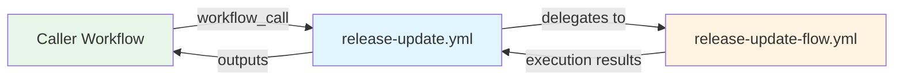

# Release Update Workflow

**Reusable workflow for updating individual platform release branches**

The Release Update workflow (`release-update.yml`) is a reusable wrapper that provides a stable interface for triggering platform release branch updates. It delegates execution to the Release Update Flow workflow while managing concurrency control and output propagation.

## 🎯 Purpose

Provides a stable, reusable interface for release branch updates:

- **Clean interface** for upstream workflow orchestration
- **Exposes structured outputs** for result tracking and reporting
- **Enforces concurrency control** to prevent simultaneous updates
- **Supports dry-run mode** for safe validation

## 🏗️ Architecture



**Single Responsibility**: This workflow only handles interface contract and concurrency—all update logic is in `release-update-flow.yml`.

## 📥 Inputs

| Input | Type | Required | Default | Description |
|-------|------|----------|---------|-------------|
| `release_branch` | string | ✓ | - | Release branch to scan (e.g., `R1-2025`) |
| `update_branch` | string | ✓ | - | Update branch name for this release |
| `dry_run` | boolean | ✗ | `false` | Perform dry run without creating PRs |
| `pr_reviewers` | string | ✗ | `''` | Comma-separated reviewers (users or `org/team`) |
| `pr_labels` | string | ✗ | `''` | Comma-separated PR labels |

## 📤 Outputs

### Execution Status
| Output | Type | Description |
|--------|------|-------------|
| `scan_result` | string | Job result (`success`/`failure`/`skipped`) |
| `workflow_status` | string | Overall workflow status |
| `failure_reason` | string | Reason for failure if any |

### Update Information
| Output | Type | Description |
|--------|------|-------------|
| `updated` | boolean | Whether updates were found |
| `new_version` | string | New platform version if updated |
| `updates_cnt` | number | Number of modules/components updated |

### Pull Request Information
| Output | Type | Description |
|--------|------|-------------|
| `pr_created` | boolean | Whether a PR was created |
| `pr_number` | string | PR number if created or updated |
| `pr_url` | string | URL of the created PR |

## 🚀 Usage

### From Parent Workflow

```yaml
jobs:
  update-release:
    uses: folio-org/platform-lsp/.github/workflows/release-update.yml@master
    with:
      release_branch: R1-2025
      update_branch: R1-2025-updates
      dry_run: false
      pr_reviewers: 'folio-org/kitfox,developer1'
      pr_labels: 'automated-update,release'
    secrets: inherit

  report-results:
    needs: update-release
    runs-on: ubuntu-latest
    steps:
      - name: Check results
        run: |
          echo "Updated: ${{ needs.update-release.outputs.updated }}"
          echo "PR URL: ${{ needs.update-release.outputs.pr_url }}"
          echo "Updates: ${{ needs.update-release.outputs.updates_cnt }}"
```

### From Matrix Strategy

```yaml
jobs:
  prepare-matrix:
    runs-on: ubuntu-latest
    outputs:
      branches: ${{ steps.build.outputs.matrix }}
    steps:
      - id: build
        run: echo 'matrix=["R1-2025","R2-2025"]' >> $GITHUB_OUTPUT

  update-branches:
    needs: prepare-matrix
    strategy:
      matrix:
        branch: ${{ fromJson(needs.prepare-matrix.outputs.branches) }}
      fail-fast: false
      max-parallel: 3
    uses: folio-org/platform-lsp/.github/workflows/release-update.yml@master
    with:
      release_branch: ${{ matrix.branch }}
      update_branch: ${{ matrix.branch }}-updates
      dry_run: false
    secrets: inherit
```

## 🔄 Workflow Delegation

This workflow is a **lightweight wrapper** with three responsibilities:

1. **Interface Contract**: Accepts standardized inputs from upstream callers
2. **Concurrency Control**: Prevents simultaneous updates to the same release branch
3. **Output Propagation**: Exposes all outputs from the delegated flow workflow

### Workflow Structure

```yaml
jobs:
  scan:
    name: Scan Branch
    uses: ./.github/workflows/release-update-flow.yml
    with:
      repo: ${{ github.repository }}
      release_branch: ${{ inputs.release_branch }}
      update_branch: ${{ inputs.update_branch }}
      workflow_run_number: ${{ github.run_number }}
      dry_run: ${{ inputs.dry_run }}
      pr_reviewers: ${{ inputs.pr_reviewers }}
      pr_labels: ${{ inputs.pr_labels }}
    secrets: inherit
```

### Why Separate Wrapper?

- **Stable Interface**: Changes to flow logic don't affect callers
- **Concurrency Management**: Repository-level locking at wrapper level
- **Reusability**: Multiple workflows can call the same interface
- **Single Responsibility**: Delegation vs implementation are separate concerns

## 🔐 Permissions

```yaml
permissions:
  contents: write        # Create/update branches and commits
  pull-requests: write   # Create/update pull requests
```

## 🛡️ Concurrency Control

```yaml
concurrency:
  group: release-scan-${{ github.repository }}-${{ inputs.release_branch }}
  cancel-in-progress: false
```

- **Per-branch locking**: Prevents concurrent updates to same release branch
- **No cancellation**: Running workflows complete before new ones start
- **Repository-scoped**: Different repos can run concurrently

## 📊 Output Usage Patterns

### Check for Updates

```yaml
- name: Notify if updated
  if: needs.update-release.outputs.updated == 'true'
  run: |
    echo "Platform updated to ${{ needs.update-release.outputs.new_version }}"
    echo "Total updates: ${{ needs.update-release.outputs.updates_cnt }}"
```

### Handle Failures

```yaml
- name: Report failure
  if: needs.update-release.outputs.workflow_status == 'failure'
  run: |
    echo "::error::Update failed: ${{ needs.update-release.outputs.failure_reason }}"
    exit 1
```

### Aggregate Results

```yaml
- name: Collect PR URLs
  run: |
    echo "PRs created:"
    echo "${{ toJson(needs.*.outputs.pr_url) }}" | jq -r '.[]'
```

## 🔗 Related Workflows

- **[release-scan.yml](release-scan.md)** – Orchestrates updates across multiple release branches (calls this workflow)
- **release-update-flow.yml** – Implements the actual update logic (called by this workflow)
- **[release-package.yml](release-package-flow.md)** – Packages platform releases

## 📝 Notes

- **Reusable only**: This workflow cannot be triggered manually or by schedule—only via `workflow_call`
- **Dry run mode** prevents PR creation and changes, useful for testing the update detection logic
- **All outputs** are propagated from the delegated flow workflow without modification
- **Concurrency key** includes repository and release branch to prevent conflicts
- **Secrets inheritance** passes repository secrets to the delegated flow workflow

