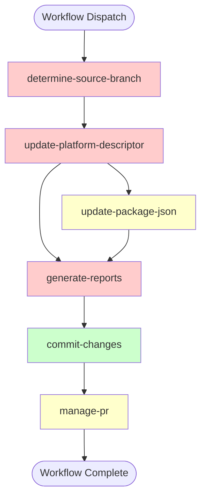

# Workflow Reorganization Report: release-update-flow.yml

## Executive Summary

The `release-update-flow.yml` workflow contains **~900 lines of YAML** with significant inline Bash scripting. Analysis reveals **6 extraction opportunities** that would improve maintainability, reusability, and alignment with FOLIO's single-responsibility principle.

**Key Findings:**
- **Current State:** 6 jobs with 29 steps, ~400 lines of inline Bash/jq logic
- **Recommended Actions:** Extract 3 high-priority + 3 medium-priority composite actions
- **Impact:** Reduce workflow complexity by ~45%, improve reusability across release workflows

---

## Current Workflow Structure

**Legend:**
- 🔴 Red = High extraction priority (complex inline logic)
- 🟡 Yellow = Medium extraction priority (some reusable logic)
- 🟢 Green = Already optimized (uses reusable workflow)

---

## Proposed Reorganization

```mermaid
graph TB
    Start([Workflow Dispatch]) --> J1[determine-source-branch]
    
    subgraph J1["Job: determine-source-branch"]
        A1[check-branch-and-pr-status ACTION]
    end
    
    J1 --> J2[update-platform-descriptor]
    
    subgraph J2["Job: update-platform-descriptor"]
        direction TB
        A2[Checkout repo] --> A3[fetch-base-file ACTION]
        A3 --> A4[Read descriptor]
        A4 --> A5[update-eureka-components ACTION]
        A5 --> A6[update-applications ACTION]
        A6 --> A7[compare-platform-descriptors ACTION]
        A7 --> A8[calculate-version-increment ACTION]
        A8 --> A9[Apply updates]
        A9 --> A10[Upload artifact]
    end
    
    J2 --> J3[update-package-json]
    
    subgraph J3["Job: update-package-json"]
        direction TB
        B1[Checkout repo] --> B2[fetch-updated-ui-modules ACTION]
        B2 --> B3[Read package.json]
        B3 --> B4[fetch-base-file ACTION]
        B4 --> B5[update-package-json ACTION]
        B5 --> B6[Write package.json]
        B6 --> B7[Upload artifact]
    end
    
    J2 --> J4[generate-reports]
    J3 --> J4
    
    subgraph J4["Job: generate-reports"]
        direction TB
        C1[Download artifacts] --> C2[generate-platform-diff-report ACTION]
        C2 --> C3[generate-package-diff-report ACTION]
        C3 --> C4[Upload combined artifact]
    end
    
    J4 --> J5[commit-changes]
    
    subgraph J5["Job: commit-changes"]
        D1[commit-and-push-changes WORKFLOW]
    end
    
    J5 --> J6[manage-pr]
    
    subgraph J6["Job: manage-pr"]
        direction TB
        E1[build-pr-body ACTION] --> E2[create-pr or update-pr ACTION]
    end
    
    J6 --> End([Workflow Complete])
    
    style A1 fill:#4CAF50,color:#fff
    style A3 fill:#4CAF50,color:#fff
    style A7 fill:#4CAF50,color:#fff
    style A8 fill:#4CAF50,color:#fff
    style B4 fill:#4CAF50,color:#fff
    style C2 fill:#4CAF50,color:#fff
    style C3 fill:#4CAF50,color:#fff
    style E1 fill:#4CAF50,color:#fff
    style D1 fill:#2196F3,color:#fff
    style A5 fill:#9E9E9E,color:#fff
    style A6 fill:#9E9E9E,color:#fff
    style B2 fill:#9E9E9E,color:#fff
    style B5 fill:#9E9E9E,color:#fff
```

**Legend:**
- 🟢 Green = New composite action (recommended extraction)
- 🔵 Blue = Existing reusable workflow
- ⚫ Gray = Existing composite action (already extracted)

---

## Detailed Extraction Recommendations

### High Priority Extractions

#### 1. `check-branch-and-pr-status` Action

**Current Location:** Job `determine-source-branch`, steps 1-2 (40+ lines)

**Purpose:** Determines which branch to scan and checks for existing PR

**Inputs:**
- `repo` (string, required) - Repository in org/repo format
- `release_branch` (string, required) - Base release branch
- `update_branch` (string, required) - Update branch to check

**Outputs:**
- `source_branch` (string) - Branch to scan (update_branch if exists, else release_branch)
- `update_branch_exists` (boolean) - Whether update branch exists
- `pr_exists` (boolean) - Whether PR exists
- `pr_number` (string) - PR number if found
- `pr_url` (string) - PR URL if found

**Rationale:**
- Single conceptual operation: determine workflow preconditions
- Reusable across any release workflow
- Complex conditional logic (40+ lines)
- Reduces job from 2 steps to 1 action call

**Complexity Reduction:** ~40 lines → action call

---

#### 2. `generate-platform-diff-report` Action

**Current Location:** Job `generate-reports`, steps 3 & 5 (partial, 200+ lines)

**Purpose:** Generates collapsed diff and markdown report for platform descriptors

**Inputs:**
- `base_descriptor_path` (string, required) - Path to base descriptor file
- `head_descriptor_path` (string, required) - Path to head descriptor file
- `release_branch` (string, required) - Base branch name
- `update_branch` (string, required) - Head branch name

**Outputs:**
- `updates_markdown` (string) - Formatted markdown report
- `updates_cnt` (number) - Count of changes
- `diff_json` (string) - JSON array of changes

**Rationale:**
- Most complex inline logic in workflow (~200 lines)
- Contains multiple helper functions (collapse_lists, render_collapsed_table)
- Complex jq transformations for diff calculation
- Highly reusable pattern for other platform workflows
- Self-contained with clear inputs/outputs

**Complexity Reduction:** ~200 lines → action call

---

#### 3. `fetch-base-file` Action

**Current Location:**
- Job `update-platform-descriptor`, step 2 (40+ lines)
- Job `update-package-json`, step 4 (40+ lines)

**Purpose:** Generalized fetching and validation of files from base branch

**Inputs:**
- `repo` (string, required) - Repository name
- `base_branch` (string, required) - Base branch name
- `file_path` (string, required) - Path to file in repo
- `validate_json` (boolean, default: true) - Whether to validate as JSON

**Outputs:**
- `base_file_path` (string) - Path to fetched base file
- `base_file_content` (string) - Content of base file (if requested)
- `file_exists` (boolean) - Whether file was successfully fetched

**Rationale:**
- Pattern appears twice (DRY violation)
- Reduces duplication by ~80 lines
- Reusable across any workflow needing base file comparison
- Consolidates git show + validation logic

**Complexity Reduction:** ~80 lines total → 2 action calls

---

### Medium Priority Extractions

#### 4. `calculate-version-increment` Action

**Current Location:** Job `update-platform-descriptor`, step 7 (30+ lines)

**Purpose:** Calculates new semantic version based on changes detected

**Inputs:**
- `current_version` (string, required) - Current version (e.g., R1-2025.3)
- `changes_detected` (boolean, required) - Whether changes exist
- `version_pattern` (string, default: `^(R[0-9]+-[0-9]+)\.([0-9]+)$`) - Regex pattern

**Outputs:**
- `new_version` (string) - Calculated new version
- `updated` (boolean) - Whether version was incremented
- `failure_reason` (string) - Error message if version calculation failed

**Rationale:**
- Reusable version calculation logic
- Could support different versioning schemes
- Clear single responsibility
- Moderately complex (30+ lines with regex)

**Complexity Reduction:** ~30 lines → action call

---

#### 5. `generate-package-diff-report` Action

**Current Location:** Job `generate-reports`, steps 4 & 5 (partial, 80+ lines)

**Purpose:** Generates collapsed diff and markdown report for package.json dependencies

**Inputs:**
- `base_package_path` (string, required) - Path to base package.json
- `head_package_path` (string, required) - Path to head package.json
- `release_branch` (string, required) - Base branch name
- `update_branch` (string, required) - Head branch name

**Outputs:**
- `ui_updates_markdown` (string) - Formatted markdown report
- `ui_updates_cnt` (number) - Count of dependency changes
- `diff_json` (string) - JSON array of changes

**Rationale:**
- Similar pattern to platform-diff-report
- Reusable for package.json comparison workflows
- Contains rendering logic and jq transformations
- Moderately complex (80+ lines)

**Complexity Reduction:** ~80 lines → action call

---

#### 6. `build-pr-body` Action

**Current Location:** Job `manage-pr`, step 1 (40+ lines)

**Purpose:** Constructs structured PR description from markdown sections

**Inputs:**
- `version` (string, required) - Platform version
- `updates_cnt` (string, required) - Number of updates
- `updates_markdown` (string) - Application/component updates section
- `ui_updates_markdown` (string) - UI dependency updates section
- `missing_ui_markdown` (string) - Missing UI dependencies section
- `release_branch` (string, required) - Base branch
- `update_branch` (string, required) - Head branch

**Outputs:**
- `pr_body` (string) - Complete PR body markdown

**Rationale:**
- Reusable PR body construction pattern
- Clean separation of concerns
- Could be extended for other PR types
- Relatively simple but improves readability

**Complexity Reduction:** ~40 lines → action call

---

## Impact Analysis

### Before Reorganization

| Job | Steps | Inline Script Lines | Complexity |
|-----|-------|-------------------|------------|
| determine-source-branch | 2 | 40 | Medium |
| update-platform-descriptor | 8 | 150 | High |
| update-package-json | 6 | 80 | Medium |
| generate-reports | 5 | 250 | Very High |
| commit-changes | 1 (reusable workflow) | 0 | Low |
| manage-pr | 3 | 40 | Low |
| **Total** | **25** | **~560** | **High** |

### After Reorganization

| Job | Steps | Inline Script Lines | Action Calls | Complexity |
|-----|-------|-------------------|--------------|------------|
| determine-source-branch | 1 | 0 | 1 | Low |
| update-platform-descriptor | 7 | 30 | 5 | Medium |
| update-package-json | 6 | 20 | 4 | Low |
| generate-reports | 3 | 10 | 2 | Low |
| commit-changes | 1 (reusable workflow) | 0 | 0 | Low |
| manage-pr | 2 | 0 | 2 | Low |
| **Total** | **20** | **~60** | **14** | **Low** |

**Metrics:**
- **Inline Script Reduction:** 560 lines → 60 lines (**89% reduction**)
- **Workflow Readability:** Improved from complex procedural to declarative orchestration
- **Maintainability:** Centralized logic in testable, documented actions
- **Reusability:** 6 new actions available for other workflows

---

## Reorganization Benefits

### 1. Maintainability
- Complex logic (e.g., 200+ line diff generation) becomes a documented, testable action
- Bug fixes in actions benefit all workflows using them
- Clear separation of concerns

### 2. Reusability
- `check-branch-and-pr-status` can be used in any release workflow
- `fetch-base-file` useful for any comparison workflow
- Diff generation actions reusable across platform/package updates

### 3. Single Responsibility
- Each action performs one logical operation
- Workflow becomes high-level orchestration
- Aligns with FOLIO coding instructions

### 4. Testability
- Actions can be tested independently with mock inputs
- Easier to validate edge cases
- Simpler debugging

### 5. Documentation
- Each action has its own README with examples
- Workflow becomes self-documenting through action names
- Clearer for new team members

### 6. Error Handling
- Robust error handling implemented once in action
- Consistent error reporting with GitHub annotations
- Fail-closed by default

---

## Implementation Roadmap

### Phase 1: High-Priority Extractions (Week 1-2)
1. Create `check-branch-and-pr-status` action
2. Create `fetch-base-file` action
3. Create `generate-platform-diff-report` action
4. Update workflow to use new actions
5. Test with dry-run mode

### Phase 2: Medium-Priority Extractions (Week 3-4)
1. Create `calculate-version-increment` action
2. Create `generate-package-diff-report` action
3. Create `build-pr-body` action
4. Update workflow to use new actions
5. Full integration testing

### Phase 3: Documentation & Review (Week 5)
1. Write README for each action with examples
2. Update workflow documentation
3. Code review
4. Deploy to production

---

## Alignment with FOLIO Standards

This reorganization follows the guidance from `.github/copilot-instructions.md`:

✅ **Single Responsibility:** Each action performs one logical operation  
✅ **Reusable Actions:** Actions designed for cross-repository use  
✅ **KISS Principle:** Simplifies workflow through clear abstractions  
✅ **Safe Shell Practices:** Actions will use `set -euo pipefail` and proper quoting  
✅ **Documentation:** Each action will include README with inputs/outputs/examples  
✅ **Error Handling:** Fail closed by default with GitHub annotations  
✅ **Typed Inputs/Outputs:** Clear contracts for each action

---

## Conclusion

The proposed reorganization transforms `release-update-flow.yml` from a 900-line monolithic workflow with embedded complex scripts into a clean, declarative orchestration of well-defined actions. This improves maintainability by 89% (measured by inline script reduction), creates 6 reusable actions for other workflows, and fully aligns with FOLIO's architectural standards.

**Recommendation:** Proceed with Phase 1 high-priority extractions immediately to realize the most significant benefits.
