# FOLIO Platform Release Workflow

This workflow (`release.yml`) automates the process of validating, packaging, and uploading FOLIO platform release artifacts to GitHub Releases.

## Purpose
- Ensures all required files and descriptors are present and valid
- Collects application descriptors from the FAR API
- Packages platform files into a distributable archive
- Uploads the archive and checksum to the corresponding GitHub Release

## Main Jobs
- **validate-and-prepare**: Checks out the repository, validates configuration, and determines the release tag.
- **create-release-artifact**: Installs dependencies, validates required files, collects descriptors, gathers files, creates the archive, and uploads it to the release.

## Key Steps
1. **Checkout repository**
2. **Validate configuration file**
3. **Determine release tag**
4. **Install dependencies (python3, jq, yq, tar, etc.)**
5. **Validate required files**
6. **Collect application descriptors from FAR API**
7. **Collect platform files and create a manifest**
8. **Create compressed archive and generate SHA256 checksum**
9. **Upload archive and checksum to GitHub Release**
10. **Verify upload and post a summary**

## Architecture Diagram
See the detailed workflow and script logic in the diagram below:

You can render or download the SVG file, or view/edit the source in `flow.mmd` with any MermaidJS-compatible tool or VSCode extension.

---

For more details on the release process and configuration, see the main repository documentation and `.github/release-config.yml`.